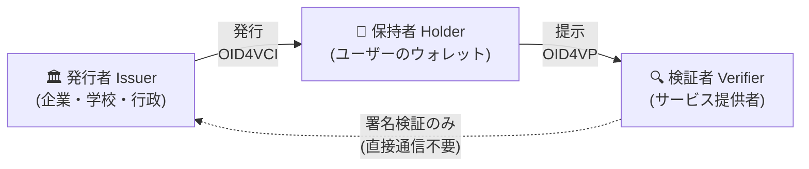

# ② OID4VC / OID4VP 対外説明資料

> **用途**: 社外のお客様・パートナー・非エンジニアの意思決定者向けに、OID4VC(VC 発行・VP 検証)の価値と当社基盤の位置づけを説明するための資料。そのままスライド化できるよう「1 セクション = 1〜2 スライド」の構成にしています。
>
> 技術的な裏付け(データ例・仕様の詳細)は [① 基礎理解ドキュメント](./01_oid4vci-vp-basics.md) を参照してください。

---

## スライド 1|デジタル証明書の「財布」の時代へ

**一言でいうと**:
紙の証明書や物理カードで行っていた「私は〇〇です」の証明を、**スマホのウォレットに入るデジタル証明書(Verifiable Credential = VC)** で行えるようにする国際標準技術です。

- 🎫 社員証・学生証・資格証・会員証・行政の証明書…あらゆる「証明」が対象
- 📱 ユーザーはスマホのウォレットアプリで受け取り、保管し、提示する
- 🌍 OpenID Foundation が標準化した **OID4VCI(発行)/ OID4VP(提示)** プロトコルに準拠すれば、**異なる事業者のウォレット・発行者・検証者が相互接続**できる

> **比喩で説明するなら**: 今の本人確認は「毎回、発行元に電話して確認してもらう」方式。VC は「偽造できない透かし入りの証明書を財布に入れて持ち歩く」方式。確認のたびに発行元へ連絡する必要がなくなります。

---

## スライド 2|なぜ今か:従来方式の 3 つの限界

| 課題 | 従来方式(ID 連携・物理カード) | VC モデル |
|---|---|---|
| **プライバシー** | ログインのたびに IdP が「どこで何をしたか」を把握。属性は全部まとめて渡ることが多い | 発行元は利用を追跡できない。**必要な属性だけ**開示(例: 生年月日を見せず「20 歳以上」のみ) |
| **コストと偽造** | 物理カードの印刷・郵送・再発行コスト。目視確認は偽造に弱い | 発行・失効はオンラインで即時。**電子署名により偽造を機械的に検知** |
| **相互運用性** | サービスごとの独自アプリ・独自形式で乱立 | 国際標準(OpenID Foundation / IETF / ISO)準拠で**エコシステム間の相互接続**が可能 |

---

## スライド 3|登場人物と基本モデル(トラストトライアングル)

**3 つのポイント**(お客様への説明の核):

1. **発行と利用が分離** — 検証者は発行者に問い合わせず、署名だけで真正性を確認。発行者のシステム停止時も検証可能
2. **ユーザーが主導権を持つ** — 何を・誰に・いつ見せるかはユーザーが同意して決める(選択的開示)
3. **盗難・使い回しに強い** — 証明書はユーザーの端末の鍵と暗号学的に紐づき(Key Binding)、他人は使えない。提示は毎回ワンタイムのチャレンジつきで、コピーの再利用(リプレイ)も不可

---

## スライド 4|体験イメージ(ユースケース)

**例 1: 社員証 VC**
1. 入社手続き完了後、人事ポータルに QR コードが表示される
2. 社員がスマホのウォレットで読み取り → 数秒で「社員証 VC」がウォレットに入る
3. 入館ゲートや社内システムで提示 → 検証は 1 秒未満、退職時は即時失効

**例 2: 年齢確認**
- 酒類の EC サイトで「20 歳以上であること」だけを提示。氏名・住所・生年月日そのものは渡さない

**例 3: 資格・在籍証明**
- 転職先への在籍証明、専門資格の提示など、紙の証明書取り寄せ(数日)が数秒に

---

## スライド 5|標準化の潮流:世界と日本

- **🇪🇺 EU — eIDAS 2.0 / EUDI Wallet**: EU 規則により全加盟国が市民へデジタル ID ウォレットを提供へ。その技術基盤に OID4VCI / OID4VP が採用。域内の大規模パイロットが進行中で、**世界のデファクトを牽引**
- **🌐 標準化団体**: OpenID Foundation(プロトコル)、IETF(SD-JWT VC・ステータス管理)、ISO(mdoc / モバイル運転免許証 18013-5)が分業しつつ整合
- **📅 仕様の成熟**: 2025 年に OID4VP 1.0(7 月)・OID4VCI 1.0(9 月)・**HAIP 1.0(12 月)が相次いで Final(確定版)化**。「ドラフトを追いかける時期」から「確定仕様に準拠する時期」へ移行
- **🇯🇵 日本**: OpenID ファウンデーション・ジャパンや各種コンソーシアムでの検討、大学・企業・自治体の実証が進む。モバイル運転免許証やデジタル学生証など、グローバル標準と整合した動きが加速

> **メッセージ**: 「独自方式で作り込む」時代は終わり、**国際標準準拠が参入の前提条件**になりつつあります。

---

## スライド 6|当社基盤のご紹介

- OID4VCI / OID4VP 準拠の **VC 発行基盤・VP 検証基盤**を開発・提供
- 対応フォーマット: **SD-JWT VC**(Web サービスとの親和性)/(必要に応じて)**ISO mdoc**
- 発行フロー: 事前本人確認済みユーザー向けの **Pre-Authorized Code Flow**、オンライン認証を組み込む **Authorization Code Flow** の両対応
- 失効管理: **Token Status List** による即時失効・プライバシー配慮型のステータス配布
- **HAIP(高保証プロファイル)対応を推進中** — EUDI Wallet と同じ土俵の相互運用性・セキュリティ水準へ(対応計画は [③ HAIP ドキュメント](./03_haip-migration-guide.md))

> 導入企業側に必要なのは「何を証明したいか(クレデンシャル設計)」の定義のみ。プロトコル・暗号・鍵管理の複雑さは基盤側が吸収します。

---

## スライド 7|セキュリティ・プライバシーの根拠(よくある質問)

**Q. 偽造されませんか?**
A. VC には発行者の電子署名が入っており、1 ビットでも改ざんすると検証に失敗します。検証者は発行者の証明書(X.509 チェーン等)をトラストリストと照合します。

**Q. スクリーンショットや転送で使い回されませんか?**
A. 提示のたびに、検証者が発行するワンタイムのチャレンジ(nonce)へ**ユーザー端末内の秘密鍵**で署名する必要があります(Key Binding)。VC のコピーだけでは提示は成立しません。

**Q. 発行者にユーザーの行動が見えてしまいませんか?**
A. 見えません。検証時に発行者への問い合わせは不要な設計です。失効確認も「まとめて配布されるステータスリスト」を用いるため、個別の利用が発行者に伝わりにくい仕組みです。

**Q. 個人情報は経路上で漏れませんか?**
A. TLS に加え、高保証プロファイル(HAIP)では**提示レスポンス自体を検証者の公開鍵で暗号化**(`direct_post.jwt`)するため、経路上のログ等にも属性が平文で残りません。

**Q. ブロックチェーンを使うのですか?**
A. 必須ではありません。OID4VC は鍵の解決方式に中立で、当社基盤は実績ある PKI(X.509)ベースで運用可能です。

---

## スライド 8|まとめ

1. **VC/VP は「証明のデジタル化」の国際標準** — OID4VCI(発行)と OID4VP(提示)が中核プロトコル
2. **2025 年に主要仕様がすべて確定(Final)** — EUDI Wallet を筆頭に社会実装フェーズへ
3. **当社は確定仕様に準拠した発行・検証基盤を提供** — さらに高保証プロファイル **HAIP** への対応で、グローバル水準の相互運用性を確保していきます

---

### 付録:想定問答(営業・CS 向けメモ)

| 質問 | 回答の要点 |
|---|---|
| 対応ウォレットは? | OID4VCI/OID4VP 準拠ウォレットと相互接続可能。特定ウォレットへのロックインなし |
| 既存の OAuth/OIDC 基盤との関係は? | OID4VC は OAuth 2.0 を土台にしており、既存の認可サーバー資産・知見を活用可能 |
| 端末を紛失したら? | VC は失効(ステータスリスト)で即時無効化し、再発行。鍵は端末のセキュア領域に保管され、端末のロック(生体認証等)でも保護される |
| 検証者は何を用意する? | OID4VP の検証エンドポイント(当社検証基盤で提供)と、信頼する発行者の設定(トラストリスト)のみ |
| 標準はまだ変わる? | コア仕様(OID4VCI/VP/HAIP 1.0)は Final となり、後方互換を壊す変更は行われない位置づけ。周辺仕様(IETF ドラフト等)の確定は継続ウォッチ |
