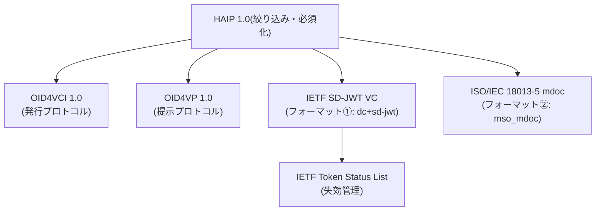
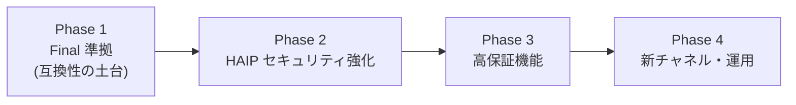

# ③ HAIP(OpenID4VC High Assurance Interoperability Profile)対応ガイド

> **対象読者**: OID4VCI / OID4VP の(ドラフト版ベースの)VC 発行・VP 検証基盤をすでに実装しており、**HAIP 1.0 Final への準拠**を目指す開発者・アーキテクト。
>
> **このドキュメントの内容**:
> 1. HAIP とは何か・なぜ対応するのか
> 2. ドラフト時代の実装からの**主要変更点**
> 3. **マスト(MUST)要件の一覧**(Issuer / Wallet / Verifier 別)
> 4. 実装方法と**移行ロードマップ**
>
> ⚠️ **注意**: 本ドキュメントは公開情報(公式仕様・解説記事)をもとに作成しています。個々の MUST/SHOULD の最終判断は、必ず [HAIP 1.0 Final 本文](https://openid.net/specs/openid4vc-high-assurance-interoperability-profile-1_0-final.html) を一次情報として確認してください。「要確認」と記した箇所は特に注意してください。

---

## 目次

1. [HAIP とは](#1-haip-とは)
2. [仕様の系譜と Final 化のタイムライン](#2-仕様の系譜と-final-化のタイムライン)
3. [既存実装からの主要変更点(ギャップ一覧)](#3-既存実装からの主要変更点ギャップ一覧)
4. [MUST 要件一覧](#4-must-要件一覧)
5. [実装方法の詳細](#5-実装方法の詳細)
6. [移行ロードマップ](#6-移行ロードマップ)
7. [適合性テスト](#7-適合性テスト)
8. [参考資料](#8-参考資料)

---

## 1. HAIP とは

**HAIP(OpenID4VC High Assurance Interoperability Profile)** は、OID4VCI / OID4VP という「選択肢の多い汎用プロトコル」に対して、**高い保証レベル(High Assurance)が求められるユースケースで採用すべきオプションを 1 つに絞り込んだプロファイル**です。OpenID Foundation の Digital Credentials Protocols (DCP) WG が策定し、**2025 年 12 月に 1.0 が Final Specification として承認**されました。

> 💡 呼び方について: 略称 HAIP は英語圏で「ハイプ(hype)」に近い発音で呼ばれることがあり、社内で「OID4VC Hype」と呼んでいるものはこの HAIP を指します。

### なぜ対応するのか

- **相互運用性の保証**: OID4VCI/VP はフォーマット・鍵解決・レスポンスモード等に多くの選択肢があり、「両者とも仕様準拠なのに繋がらない」ことが起こり得ます。HAIP はこれを排除します。
- **EUDI Wallet との整合**: EU デジタル ID ウォレットのエコシステムが HAIP の方向性(SD-JWT VC + mdoc、X.509 トラスト、暗号化レスポンス)と揃っており、HAIP 準拠 ≒ グローバル水準の相互運用性です。
- **セキュリティ水準の底上げ**: レスポンス暗号化、送信者制約トークン(DPoP)、Wallet/Key Attestation など、高保証ユースケース(行政・金融等)で要求される対策が必須化されています。

### HAIP がプロファイルする仕様のスタック



---

## 2. 仕様の系譜と Final 化のタイムライン

| 時期 | 出来事 | 実装への意味 |
|---|---|---|
| 〜2024 | OID4VCI / OID4VP はドラフト(draft 13 / draft 20 など)が乱立。実装ごとに参照ドラフトが異なる | 既存基盤の多くはこの時期のドラフト準拠 |
| 2024-10 | OID4VP draft 22 で **DCQL** 導入 | `presentation_definition` からの移行が始まる |
| **2025-07** | **OID4VP 1.0 Final 承認** | `presentation_definition` は仕様から削除。DCQL に一本化 |
| **2025-09** | **OID4VCI 1.0 Final 承認** | Nonce Endpoint の導入等、ドラフトからの差分が確定 |
| 2025-10〜12 | HAIP 1.0 のパブリックレビュー(60 日)→ メンバー投票(12/9〜12/23) | |
| **2025-12** | **HAIP 1.0 Final 承認** | 高保証プロファイルが確定。以後、非互換の改訂は行われない |

**結論**: 「どのドラフトに合わせるか」を悩む時期は終わりました。**OID4VCI 1.0 / OID4VP 1.0 / HAIP 1.0 の Final 3 点セット**が今後の準拠ターゲットです。

---

## 3. 既存実装からの主要変更点(ギャップ一覧)

ドラフト時代(おおよそ OID4VCI draft 13 前後 / OID4VP draft 20 前後)の実装を基準に、Final + HAIP で対応が必要になる典型的なギャップです。**自基盤の棚卸しチェックリスト**として使ってください。

| # | 項目 | ドラフト時代の実装 | Final / HAIP での要求 | 影響範囲 |
|---|---|---|---|---|
| 1 | SD-JWT VC のフォーマット識別子 / `typ` | `vc+sd-jwt` | **`dc+sd-jwt`**(メタデータ、DCQL、JWT `typ` ヘッダすべて) | Issuer / Wallet / Verifier |
| 2 | 提示要求のクエリ言語 | `presentation_definition`(DIF PE) | **DCQL(`dcql_query`)のみ**。PE は OID4VP 1.0 で削除 | Verifier / Wallet |
| 3 | 提示レスポンスの保護 | `direct_post`(平文 POST) | **`direct_post.jwt`(JWE 暗号化)必須**。鍵合意は ECDH-ES | Verifier / Wallet |
| 4 | リクエストの真正性 | 平文リクエスト or 任意の署名 | **署名付きリクエスト(JAR)必須**。`x5c` に X.509 チェーン | Verifier / Wallet |
| 5 | Verifier の識別(`client_id`) | `client_id_scheme` パラメータ(別パラメータ方式) | **`client_id` プレフィックス方式**に統合(例: `x509_san_dns:verifier.example.com`)。HAIP は X.509 系プレフィックス(`x509_san_dns` / `x509_hash`)を採用(※どちらが MUST かは Final 本文で要確認) | Verifier / Wallet |
| 6 | 発行時の nonce(`c_nonce`) | トークンレスポンスや Credential レスポンスで受領 | **専用の Nonce Endpoint** から取得 | Issuer / Wallet |
| 7 | Credential リクエスト/レスポンス形式 | `format` + `credential`(単数) | `credential_configuration_id` + **`proofs`(複数形)/ `credentials`(複数形)** | Issuer / Wallet |
| 8 | アクセストークン | Bearer | **DPoP(RFC 9449)による送信者制約**必須 | Issuer / Wallet |
| 9 | 認可リクエスト | 通常の認可リクエスト | **PAR(RFC 9126)+ PKCE(S256)**必須、認可レスポンスに `iss` を含める | Issuer / Wallet |
| 10 | ウォレットのクライアント認証 | `client_id` のみ / 認証なし | **Wallet Attestation**(OID4VCI 付録で定義される Attestation ベースのクライアント認証。検証鍵は `x5c` で提示) | Issuer / Wallet |
| 11 | 鍵の保証 | proof JWT のみ(鍵の保管環境は不問) | **Key Attestation**(OID4VCI 付録)により、鍵がセキュアエリア(WSCD 等)に保管されていることを証明 | Issuer / Wallet |
| 12 | 失効管理 | 独自 or 未実装 | **IETF Token Status List** | Issuer / Verifier |
| 13 | 暗号アルゴリズム | 実装依存(RS256 等が混在) | **ES256(P-256)**をベースラインとして統一(※詳細な必須スイートは Final 本文で要確認) | 全コンポーネント |
| 14 | ブラウザ連携 | カスタム URL スキーム(`openid4vp://`)のみ | **W3C Digital Credentials API(DC API)経由の OID4VP** がプロファイル化(`dc_api` 系 response mode)。カスタムスキームの課題(フィッシング・OS 間差異)への対策 | Verifier / Wallet |
| 15 | クレデンシャルフォーマット | 実装依存 | **SD-JWT VC(`dc+sd-jwt`)と ISO mdoc(`mso_mdoc`)**。ウォレットは両対応必須、Issuer/Verifier はどちらかを選択可 | 全コンポーネント |

---

## 4. MUST 要件一覧

公開情報から確認できた HAIP 1.0 の主要な必須要件を、コンポーネント別に整理します。

### 4.1 発行基盤(Issuer / 認可サーバー)の MUST

- [ ] **認可コードフロー(`authorization_code` グラント)をサポート**する。認可コードフローでは `scope` 値でクレデンシャル種別を識別できるようにする
- [ ] **PAR(Pushed Authorization Requests)** を要求する(認可エンドポイント利用時)
- [ ] **PKCE(S256)** を強制する
- [ ] 認可レスポンスに **`iss`** を含める(RFC 9207)
- [ ] **DPoP** を受け付け、`DPoP-Nonce` ヘッダを運用する(トークン・Nonce・Credential 各エンドポイント)
- [ ] **Wallet Attestation によるクライアント認証**を検証する(検証鍵・トラストチェーンは `x5c` ヘッダ)
- [ ] **Key Attestation** を検証する(proof の鍵がセキュアな環境で保持されていることの確認。`x5c` ヘッダ要件あり)
- [ ] クレデンシャルは **`dc+sd-jwt`(SD-JWT VC)または `mso_mdoc`(mdoc)** で発行する
- [ ] SD-JWT VC には **Issuer の X.509 証明書チェーン(`x5c`)** を含め、Verifier が JWKS 問い合わせなしに検証可能にする
- [ ] SD-JWT VC に **Token Status List による `status`** を付与し、失効管理を提供する
- [ ] 署名アルゴリズムは **ES256(P-256)** をサポートする

### 4.2 検証基盤(Verifier)の MUST

- [ ] 認可リクエストは **署名付きリクエストオブジェクト(JAR)** とし、**X.509 証明書チェーン(`x5c`)** で Verifier の身元を証明する
- [ ] `client_id` は **X.509 系プレフィックス**(`x509_san_dns` / `x509_hash`)を用いる(※Final での指定は本文要確認)
- [ ] クエリは **DCQL(`dcql_query`)** で表現する(`presentation_definition` は使用不可)
- [ ] **`response_mode=direct_post.jwt`** を用い、レスポンス暗号化(**ECDH-ES** による JWE)のための鍵を `client_metadata` で提供する
- [ ] 受領した VP について、Issuer 署名(X.509 チェーン → トラストアンカー)、ディスクロージャ整合、**KB-JWT(`nonce` / `aud` / `sd_hash`)**、有効期限、**Status List** を検証する
- [ ] `dc+sd-jwt` および/または `mso_mdoc` の検証をサポートする(少なくとも受け入れる形式を明示)
- [ ] (ブラウザ経由のユースケースでは)**DC API 経由の OID4VP** に対応する

### 4.3 ウォレット(Holder)の MUST ※自社でウォレットも提供する場合

- [ ] **SD-JWT VC と mdoc の両フォーマット**をサポートする
- [ ] 認可コードフロー、PAR、PKCE、DPoP(`DPoP-Nonce` ハンドリング含む)をサポートする
- [ ] **Wallet Attestation** を提示できる(WSCD/セキュアエレメント等と連携)
- [ ] **Key Attestation** つきの proof を生成できる
- [ ] 署名付きリクエストの検証(X.509 チェーン検証、トラストアンカー照合)を行い、Verifier の身元をユーザーに表示する
- [ ] `direct_post.jwt` でレスポンスを暗号化して送信する
- [ ] KB-JWT による Key Binding を必ず行う

> 📝 Pre-Authorized Code Flow の扱い(MUST か OPTIONAL か)、`x509_san_dns` と `x509_hash` の使い分け、DC API 対応の必須範囲などは、HAIP Final 本文の該当セクションを直接確認して確定してください(本ドキュメント末尾の一次情報リンク参照)。

---

## 5. 実装方法の詳細

### 5.1 フォーマット識別子の移行(`vc+sd-jwt` → `dc+sd-jwt`)

影響箇所を横断的に修正します。**互換期間中は両方受け付け、送信は新識別子**にするのが安全です。

```diff
// Issuer メタデータ
 "credential_configurations_supported": {
   "EmployeeCredential": {
-    "format": "vc+sd-jwt",
+    "format": "dc+sd-jwt",
     ...
   }
 }

// 発行する SD-JWT の JOSE ヘッダ
-{ "typ": "vc+sd-jwt", "alg": "ES256", "x5c": ["MIIC..."] }
+{ "typ": "dc+sd-jwt", "alg": "ES256", "x5c": ["MIIC..."] }
```

HTTP 上のメディアタイプも `application/dc+sd-jwt` になります。

### 5.2 DCQL への移行

`presentation_definition`(JSONPath ベースで柔軟すぎ、実装差異が出やすかった)から、専用設計の DCQL へ移行します。

```json
// 旧: presentation_definition(廃止)
{
  "id": "vp-request-1",
  "input_descriptors": [{
    "id": "employee",
    "constraints": { "fields": [{ "path": ["$.employee_id"] }] }
  }]
}
```

```json
// 新: dcql_query
{
  "credentials": [
    {
      "id": "employee",
      "format": "dc+sd-jwt",
      "meta": { "vct_values": ["https://credentials.example.com/employee_credential"] },
      "claims": [
        { "path": ["employee_id"] },
        { "path": ["family_name"] }
      ]
    }
  ]
}
```

実装ポイント:

- レスポンスの `vp_token` は **DCQL の `id` をキーとする JSON オブジェクト**になる(値は提示物の配列)。旧実装の `presentation_submission` は不要になり、**マッチング結果の対応付けが単純化**される
- 複数クレデンシャルの組み合わせ要求は `credential_sets` で表現できる
- mdoc の場合は `format: "mso_mdoc"`、`meta.doctype_value`、`claims[].path` に `[namespace, element]` を使う

### 5.3 レスポンス暗号化(`direct_post.jwt`)

1. Verifier はリクエストの `client_metadata` に**暗号化用公開鍵(`use: "enc"`)**と対応可能な `enc` を載せる
2. ウォレットは認可レスポンス(`vp_token` 等)を **JWE(alg: ECDH-ES 系, enc: A128GCM 等)** で暗号化し、`response` パラメータとして POST する
3. Verifier は秘密鍵で復号してから通常の検証を行う

```http
POST /response HTTP/1.1
Host: verifier.example.com
Content-Type: application/x-www-form-urlencoded

response=eyJhbGciOiJFQ0RILUVTIiwiZW5jIjoiQTEyOEdDTSIsImVwayI6ey4uLn19..
```

> 💡 **なぜ必須か**: `direct_post`(平文)ではリバースプロキシ・WAF・アクセスログ等に個人属性が残るリスクがあります。TLS の終端より内側も守るのが高保証プロファイルの思想です。ヘッダの `apu`/`apv` や JWE 内の `nonce` 検証など、細部は OID4VP 1.0 §8.3 に従ってください。

### 5.4 署名付きリクエスト + X.509 ベースの Verifier 認証

```json
// リクエストオブジェクト JWT のヘッダ
{
  "typ": "oauth-authz-req+jwt",
  "alg": "ES256",
  "x5c": ["MIIDVerifierCert...", "MIIDIntermediate..."]
}
// ペイロード(抜粋)
{
  "client_id": "x509_san_dns:verifier.example.com",
  "response_mode": "direct_post.jwt",
  "dcql_query": { ... },
  "nonce": "n-0S6_WzA2Mj"
}
```

ウォレット側の検証: ① `x5c` のチェーンをトラストアンカー(トラストリスト)まで検証 → ② `client_id` プレフィックスの規則で証明書と `client_id` の一致を確認(`x509_san_dns` なら SAN dNSName と一致)→ ③ JWT 署名をリーフ証明書の鍵で検証。

**実装準備**: Verifier 用のクライアント証明書の発行・更新(有効期限管理)と、ウォレット側に配るトラストアンカーの配布運用(トラストリスト管理)が新たな運用要件になります。

### 5.5 OAuth 層の強化(PAR / PKCE / DPoP / `iss`)

いずれも成熟した OAuth 拡張であり、既存の認可サーバー製品・ライブラリの設定で有効化できることが多い部分です。

- **PAR(RFC 9126)**: 認可リクエストを事前に `POST /par` で登録し、`request_uri` で参照。`require_pushed_authorization_requests=true` を設定
- **PKCE(RFC 7636)**: `code_challenge_method=S256` を必須化
- **`iss` レスポンスパラメータ(RFC 9207)**: 認可レスポンスへ `iss` を付与(ミックスアップ攻撃対策)
- **DPoP(RFC 9449)**: アクセストークンをウォレットの鍵に紐づけ(盗まれても使えない)。`DPoP-Nonce` ヘッダの払い出し・再試行フローを Token / Nonce / Credential エンドポイントで実装

### 5.6 Wallet Attestation / Key Attestation

高保証プロファイルの肝で、**「どのウォレット実装か」「鍵がどこに保管されているか」を暗号学的に証明**する仕組みです。

- **Wallet Attestation**: ウォレットプロバイダのバックエンドが「このクライアントは正規のウォレットアプリ X である」ことを証明する JWT を発行し、ウォレットがクライアント認証(OAuth Attestation-Based Client Authentication)に使う。検証鍵とトラストチェーンは **`x5c` ヘッダ**で提示
- **Key Attestation**(OID4VCI 付録で定義): proof の鍵ペアが**セキュアエレメント / StrongBox / Secure Enclave 等(WSCD)で生成・保管されている**ことを証明するアテステーションを proof に添付。Issuer はこれを検証してから `cnf` に鍵を焼き込む

発行基盤側の実装ポイント:

1. 信頼するウォレットプロバイダのトラストアンカーを登録できる管理機能
2. Attestation JWT の検証(署名、`x5c` チェーン、有効期限、失効)
3. Attestation の検証結果とポリシー(例: 「PID 相当はハードウェア保護鍵のみ許可」)の突合

### 5.7 Token Status List(失効管理)

1. 発行時に `status.status_list.{idx,uri}` を SD-JWT VC へ埋め込む
2. Status List Token(ビット列 + Issuer 署名、`typ: statuslist+jwt`)を公開するエンドポイントを実装
3. 失効操作(退職・紛失等)でビットを更新し、再署名・再公開
4. Verifier 側はキャッシュ戦略(`ttl`)を持って取得・照合

### 5.8 DC API(W3C Digital Credentials API)対応

ブラウザ・OS(Android / iOS / Chrome 等)がウォレット呼び出しを仲介する新しい経路です。カスタム URL スキーム方式の課題(どのウォレットが開くか不定、フィッシング耐性が低い、cross-device の同一性確認が弱い)を解決します。

- Verifier のフロントエンドは `navigator.credentials.get()`(digital credential タイプ)で要求を発行
- response mode は **`dc_api` / `dc_api.jwt`**(HAIP では署名付きリクエスト+暗号化レスポンスの `dc_api.jwt` が基本)
- リクエストの `expected_origins` により、ブラウザが検証済みのオリジンとリクエストの整合を担保

> 実装優先度: リダイレクト/QR 方式は引き続き有効です。DC API はブラウザ・OS の普及状況を見つつ、**インターフェース層を差し替え可能な設計**(プロトコルコアと呼び出し経路の分離)にしておくことを推奨します。

---

## 6. 移行ロードマップ

既存基盤(ドラフト準拠)から HAIP 準拠への段階的な移行案です。



| フェーズ | 作業項目 | 対応するギャップ(§3) |
|---|---|---|
| **Phase 1: コア仕様 Final 準拠** | `dc+sd-jwt` への識別子移行(送信は新、受信は新旧両対応)/ DCQL 実装・PE 廃止 / Nonce Endpoint / `proofs`・`credentials` 複数形対応 | #1, #2, #6, #7 |
| **Phase 2: セキュリティ強化** | PAR + PKCE + `iss` / DPoP / 署名付きリクエスト(JAR + `x5c`)/ `client_id` プレフィックス / `direct_post.jwt` 暗号化 / ES256 (P-256) への統一 | #3, #4, #5, #8, #9, #13 |
| **Phase 3: 高保証機能** | Wallet Attestation 検証 / Key Attestation 検証 / Token Status List / トラストリスト管理(Issuer・Verifier・Wallet Provider の各アンカー) | #10, #11, #12 |
| **Phase 4: 新チャネル・運用** | DC API 対応 / mdoc(`mso_mdoc`)対応判断 / 証明書ライフサイクル運用 / 適合性テスト・相互運用テストへの参加 | #14, #15 |

**優先順位の考え方**:

- Phase 1 は**相互接続の前提条件**(ここがズレると Final 準拠ウォレットと一切通信できない)なので最優先
- Phase 2 は既存 OAuth ミドルウェアの設定・拡張で対応できる項目が多く、費用対効果が高い
- Phase 3 はトラストフレームワーク(誰を信頼するかの運用)の設計が本体。技術実装より**運用設計に時間がかかる**ため早期に着手
- mdoc 対応(#15)は、対面提示や運転免許証系ユースケースの有無で判断(ウォレットを自社提供しないなら Issuer/Verifier は SD-JWT VC のみでも HAIP の範囲内)

---

## 7. 適合性テスト

- OpenID Foundation は **OID4VCI / OID4VP / HAIP の適合性テストスイート(Conformance Suite)** を提供しています。移行の各フェーズ完了時にテストを回し、認定(Certification)取得をマイルストーンにすることを推奨します
- OIDF 主催の**相互運用イベント(interop event)**も定期開催されており、他社ウォレット・Verifier との実地テストの機会になります

---

## 8. 参考資料

### 一次情報(必読)

- [OpenID4VC High Assurance Interoperability Profile 1.0(Final)](https://openid.net/specs/openid4vc-high-assurance-interoperability-profile-1_0-final.html)
- [HAIP 1.0 Final 承認アナウンス(OpenID Foundation)](https://openid.net/openid4vc-high-assurance-interoperability-profile-haip-1-0-final-specification-approved/)
- [OpenID for Verifiable Credential Issuance 1.0(Final)](https://openid.net/specs/openid-4-verifiable-credential-issuance-1_0-final.html)
- [OpenID for Verifiable Presentations 1.0(Final)](https://openid.net/specs/openid-4-verifiable-presentations-1_0-final.html)
- [HAIP GitHub リポジトリ(Issue で議論経緯を確認可能)](https://github.com/openid/OpenID4VC-HAIP)

### 関連仕様

- [IETF SD-JWT(Selective Disclosure for JWTs)](https://datatracker.ietf.org/doc/draft-ietf-oauth-selective-disclosure-jwt/)
- [IETF SD-JWT VC](https://datatracker.ietf.org/doc/draft-ietf-oauth-sd-jwt-vc/)
- [IETF Token Status List](https://datatracker.ietf.org/doc/draft-ietf-oauth-status-list/)
- [RFC 9126: OAuth 2.0 Pushed Authorization Requests](https://www.rfc-editor.org/rfc/rfc9126)
- [RFC 9449: OAuth 2.0 Demonstrating Proof of Possession (DPoP)](https://www.rfc-editor.org/rfc/rfc9449)
- [RFC 9207: OAuth 2.0 Authorization Server Issuer Identification](https://www.rfc-editor.org/rfc/rfc9207)
- [W3C Digital Credentials API](https://w3c-fedid.github.io/digital-credentials/)

### 解説記事

- [Authlete: OpenID for Verifiable Credential Issuance(日本語)](https://www.authlete.com/ja/developers/oid4vci/)
- [Qiita: OpenID for Verifiable Credentials 解説(川崎貴彦氏)](https://qiita.com/TakahikoKawasaki/items/e37caf50776e00e733be)
- [HAIP 1.0 for Verifiable Presentations: Securing the VP Flow(DZone)](https://dzone.com/articles/haip-1-0-securing-verifiable-presentations)
