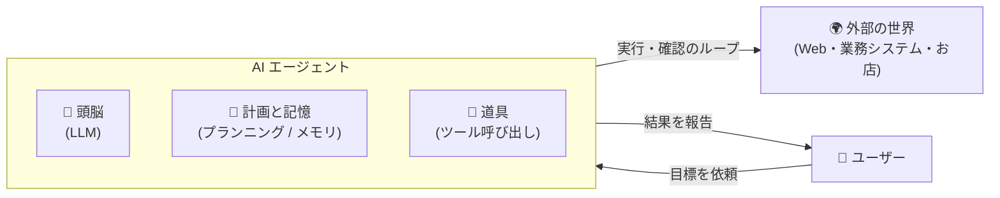
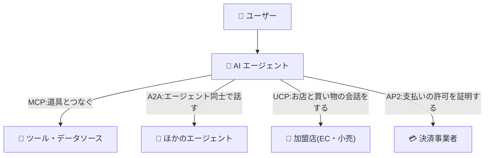
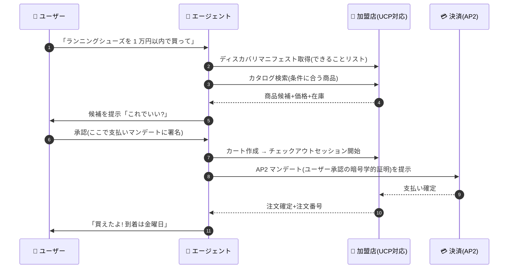

# ⑤ AI エージェントと UCP 基礎理解ドキュメント

> **対象読者**: 新入社員・AI エージェント関連技術の初心者。
>
> **このドキュメントのゴール**: 「AI エージェントとは何か」「UCP(Universal Commerce Protocol)とは何か」を人に説明できるようになること。あわせて、当社が取り組む **DID / VC(OID4VC・HAIP)とどうつながるのか**を理解すること。
>
> 🏮 アニメ風の紙芝居版もあります → [はいぷ先生の まほうのルールブック(第 2 話)](./04_haip-kamishibai.html)

---

## 目次

1. [AI エージェントとは](#1-ai-エージェントとは)
2. [エージェントを支えるプロトコル群(MCP / A2A / AP2 / UCP)](#2-エージェントを支えるプロトコル群mcp--a2a--ap2--ucp)
3. [UCP(Universal Commerce Protocol)とは](#3-ucpuniversal-commerce-protocolとは)
4. [UCP の仕組み](#4-ucp-の仕組み)
5. [DID / VC(当社基盤)との接点](#5-did--vc当社基盤との接点)
6. [用語集](#6-用語集)
7. [参考資料](#7-参考資料)

---

## 1. AI エージェントとは

### 1.1 「チャット AI」と「エージェント」の違い

ChatGPT や Claude のような **チャット AI** は「質問に答える」のが仕事です。**AI エージェント**は、そこから一歩進んで「**目標を渡すと、自分で考えて・道具を使って・やり遂げる**」存在です。

| | チャット AI | AI エージェント |
|---|---|---|
| 入力 | 質問・指示 | **目標**(例:「来週の大阪出張の新幹線とホテルを手配して」) |
| 動き | 1 回答えて終わり | 計画 → 道具を使う → 結果を確認 → やり直す…の**ループ** |
| 道具 | なし(知識だけで回答) | 検索、社内システム、EC サイト、決済 API などの**外部ツール** |
| 例 | 「大阪のおすすめホテルは?」に回答 | 空席を調べ、条件に合う便とホテルを予約し、経費申請の下書きまで作る |

### 1.2 エージェントの中身(4 つの部品)

1. **頭脳(LLM)**: 状況を理解し、次の一手を考える
2. **計画・記憶**: タスクを分解し、途中経過を覚えておく
3. **道具(ツール)**: 検索・ファイル操作・API 呼び出しなど、実世界に働きかける手足
4. **ループ**: 「実行 → 結果を見る → 修正する」を目標達成まで繰り返す

> 💡 **新人向けのたとえ**: チャット AI が「物知りな相談相手」なら、エージェントは「**おつかいを頼める有能なアシスタント**」。ただし、アシスタントにおつかいを頼むには「お店との共通語」と「お金を渡す安全な方法」が必要になります。それが次章以降のプロトコルの話です。

---

## 2. エージェントを支えるプロトコル群(MCP / A2A / AP2 / UCP)

エージェントが実世界で働くには、いろいろな相手と「話す約束事(プロトコル)」が要ります。2024〜2026 年にかけて、役割分担のはっきりした標準が出そろいました。

| プロトコル | 一言でいうと | 主導 | 標準化の状況 |
|---|---|---|---|
| **MCP** (Model Context Protocol) | エージェントと**道具(ツール・データ)**をつなぐ共通コネクタ。「AI 界の USB-C」 | Anthropic(2024-11 発表) | オープン仕様。業界横断で採用が拡大 |
| **A2A** (Agent2Agent) | **エージェント同士**が能力を公開し合い、協力して仕事するための会話規約 | Google(2025-04 発表)→ Linux Foundation | オープン仕様 |
| **AP2** (Agent Payments Protocol) | エージェントによる**支払い**を安全にする規約。「ユーザーが本当に許可した」ことの暗号学的証明(マンデート)を扱う | Google + 決済業界(2025-09 発表) | オープン仕様 |
| **UCP** (Universal Commerce Protocol) | エージェントと**お店**の間の「買い物の共通語」。商品検索からカート、決済、注文管理までを標準化 | Google + Shopify ほか 20 社以上(**2026-01 発表**) | オープン仕様(バージョン 2026-01) |

> 📝 覚え方: **MCP = 道具と話す** / **A2A = 仲間と話す** / **UCP = お店と話す** / **AP2 = お金の許可を証明する**。UCP は MCP・A2A・AP2 を「部品として組み込める」上位のアプリケーション標準です。
>
> 📝 類似規格として OpenAI + Stripe 主導の **ACP(Agentic Commerce Protocol)**(2025-09)もあります。「エージェント経由の買い物」という同じ課題への別アプローチで、現在は UCP 陣営(Google/Shopify/Walmart 等)と ACP 陣営(OpenAI/Stripe/Etsy 等)が並走しています。動向は要ウォッチです。

---

## 3. UCP(Universal Commerce Protocol)とは

### 3.1 何が課題だったのか

「エージェントに買い物を頼む(**エージェンティックコマース**)」需要が急拡大する一方、お店(EC サイト)側の API は各社バラバラでした。エージェント開発者は **お店ごとに個別対応**(スクレイピングや独自 API 連携)を強いられ、お店側も「どのエージェントを信じてよいか」「本当に本人が許可した注文か」を確認するすべがありませんでした。

> これは、OID4VC 登場前の VC 業界で「みんな仕様がバラバラでつながらなかった」問題(→ HAIP の動機)と**まったく同じ構図**です。

### 3.2 UCP の登場

- **2026 年 1 月 11 日**、全米小売業協会(NRF)のカンファレンスで Google が発表
- **Shopify、Etsy、Wayfair、Target、Walmart など 20 社以上**がローンチパートナー
- **オープンソース仕様**(ライセンス料不要)。仕様は [ucp.dev](https://ucp.dev/) と GitHub で公開
- 「AI エージェント・加盟店・決済事業者の間の**共通言語**」を確立し、商品発見からチェックアウトまでをカスタム開発なしでつなぐことが目的

---

## 4. UCP の仕組み

### 4.1 3 層のアーキテクチャ

UCP は責務を 3 つの層に分けたレイヤード設計です。

| 層 | 役割 | 例 |
|---|---|---|
| **Shopping サービス(コア)** | 取引の基本プリミティブを定義 | セッション、共通ヘッダ、エラー形式 |
| **Capabilities(能力)** | 個別にバージョン管理される機能ブロック | 商品カタログの検索・参照(Catalog Search / Lookup)、カート構築、アイデンティティ連携(Identity Linking)、チェックアウト、注文管理(Order Management) |
| **Extensions(拡張)** | Capability にドメイン固有スキーマを追加(逆ドメイン名で識別) | **AP2 Mandates 拡張**(後述)、業種固有の商品属性 など |

### 4.2 ディスカバリ(お店の「できることリスト」)

エージェントはまず、お店が公開する **ディスカバリマニフェスト(JSON)** を 1 回取得するだけで、そのお店の対応 Capability・バージョン・スキーマ URL・対応する決済ハンドラを把握できます。OID4VCI の Issuer メタデータ(`/.well-known/openid-credential-issuer`)と同じ発想の「自己紹介ファイル」です。

### 4.3 リクエストの安全装置(必須ヘッダ)

UCP のリクエストには **4 つの必須ヘッダ**があり、なりすまし・改ざん・二重実行を防ぎます。

| ヘッダ | 役割 |
|---|---|
| `UCP-Agent` | どのエージェントか(身元表明) |
| リクエスト署名(request-signature) | ボディの署名。改ざん検知と送信者証明 |
| idempotency-key | 同じ注文の**二重実行防止**(リトライしても 1 回だけ実行) |
| request-id | トレース用 ID(監査・デバッグ) |

### 4.4 トランスポート:REST でも MCP でも A2A でも

UCP は特定の通信方式に縛られず、**REST / JSON-RPC、MCP、A2A のバインディング**を持ちます。つまり「エージェントが MCP ツールとしてお店を呼ぶ」ことも「A2A でお店側エージェントと会話する」こともでき、既存のエージェント基盤にそのまま載せられます。

### 4.5 買い物フローの全体像

### 4.6 AP2 マンデート:「本当に頼まれたの?」の証明

エージェント経由の買い物で最大の問題は「**その注文、本当にユーザーが許可したの?**」です。AP2 はこれを **マンデート(mandate)= ユーザーの承認内容に対する電子署名つきの委任状**で解決します。

- ユーザーは「何を・いくらまで・いつまでに」という条件に**暗号学的に署名**
- エージェントはこのマンデートを提示して支払いを実行
- 加盟店・決済事業者は署名を検証でき、**「勝手に買った」「言った言わないの水掛け論」を排除**
- UCP では、チェックアウト Capability の **AP2 Mandates 拡張**としてネゴシエーションされる

---

## 5. DID / VC(当社基盤)との接点

ここが本ドキュメントで一番伝えたいことです。**UCP / AP2 の信頼の仕組みは、当社が取り組む VC(Verifiable Credential)の技術そのもの**です。

| UCP / AP2 側の概念 | DID / VC 側の対応物 | 接点 |
|---|---|---|
| AP2 マンデート(ユーザー承認の暗号学的証明) | **Verifiable Credential**(署名つき証明書)。AP2 の仕様はマンデートを VC ベースで構成 | 当社の VC 発行・検証の知見がそのまま活きる |
| エージェント/ユーザーの身元証明 | OID4VP による属性提示、Key Binding | 「エージェントに権限を委任した本人」の確認に VC 提示が使える |
| Identity Linking Capability | OAuth 2.0 ベースのアカウント連携 | OID4VCI が OAuth ベースであるのと同じ土台 |
| ディスカバリマニフェスト | OID4VCI の Issuer メタデータ | 「自己紹介ファイルを 1 回取得」という同じ設計思想 |
| リクエスト署名・検証、トラストリスト | HAIP の署名付きリクエスト+X.509 チェーン | 「誰を信頼するか」の運用設計が共通課題 |

**まとめると**: AI エージェントが人間の代わりに行動する時代には、「**この行動は、確かに本人が許可した**」を機械的に検証できる仕組みが不可欠になります。それは VC / VP 検証の世界で私たちが作ってきたものと同じ技術スタック(電子署名、選択的開示、Key Binding、トラストリスト)であり、**DID/VC 基盤はエージェント時代の信頼インフラ**として価値が広がっていく、というのが大きな潮流です。

---

## 6. 用語集

| 用語 | 意味 |
|---|---|
| AI エージェント | 目標を与えると、自律的に計画・ツール実行・確認を繰り返して達成する AI システム |
| エージェンティックコマース | AI エージェントが人間の代わりに商品を探し、購入する形態の商取引 |
| LLM | 大規模言語モデル。エージェントの「頭脳」 |
| ツール(ツール呼び出し) | エージェントが使う外部機能(検索、API、ファイル操作など) |
| MCP | Model Context Protocol。エージェントとツール/データソースをつなぐ標準(Anthropic) |
| A2A | Agent2Agent Protocol。エージェント間連携の標準(Google → Linux Foundation) |
| AP2 | Agent Payments Protocol。エージェント決済の標準。マンデートで委任を証明 |
| マンデート | 「何を・いくらまで」というユーザー承認への電子署名つき委任状。VC ベース |
| **UCP** | Universal Commerce Protocol。エージェントと加盟店の「買い物の共通語」(Google + 20 社超、2026-01 発表、オープンソース) |
| Capability | UCP の機能ブロック(カタログ検索、カート、チェックアウト等)。個別にバージョン管理 |
| Extension | Capability への拡張(AP2 Mandates 拡張など)。逆ドメイン名で識別 |
| ディスカバリマニフェスト | 加盟店の対応機能を列挙した JSON の「自己紹介ファイル」 |
| idempotency-key | 二重実行防止キー。リトライしても注文が 1 回しか実行されないようにする |
| ACP | Agentic Commerce Protocol。OpenAI + Stripe 主導の類似規格(UCP と並走中) |

---

## 7. 参考資料

- [Universal Commerce Protocol 公式サイト(ucp.dev)](https://ucp.dev/)
- [UCP 仕様リポジトリ(GitHub)](https://github.com/universal-commerce-protocol/ucp)
- [Google for Developers: UCP ガイド](https://developers.google.com/merchant/ucp)
- [Google Developers Blog: Under the Hood — UCP](https://developers.googleblog.com/under-the-hood-universal-commerce-protocol-ucp/)
- [Shopify Engineering: Building the Universal Commerce Protocol](https://shopify.engineering/ucp)
- [Model Context Protocol(MCP)](https://modelcontextprotocol.io/)
- [Agent2Agent Protocol(A2A)](https://a2a-protocol.org/)
- [Agent Payments Protocol(AP2)](https://ap2-protocol.org/)

> ⚠️ UCP は 2026 年 1 月に発表されたばかりの新しい仕様です(現行バージョン 2026-01)。本ドキュメントは公開情報に基づく概要であり、実装検討時は一次情報(公式仕様)を必ず参照してください。
